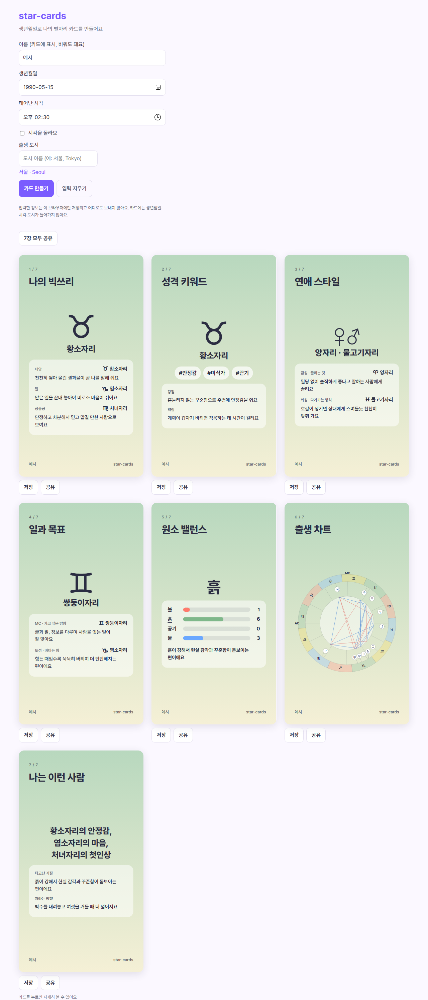

# star-cards

생년월일과 태어난 시각, 태어난 도시를 넣으면 서양 점성술 배치를 인스타그램 스토리 크기(9:16) 카드 일곱 장으로 만들어 주는 정적 웹사이트다. 카드는 한 장씩 PNG로 저장하거나 휴대폰 공유 시트로 바로 보낼 수 있다.

계산은 자매 저장소 [star-voyage](https://github.com/serenwoon/star-voyage)의 엔진을 그대로 가져다 쓴다. 이 저장소가 새로 만든 것은 카드 화면과 문구, 이미지 저장·공유 쪽이다.



위 화면은 1990-05-15 14:30 서울, 이름 「예시」라는 가상의 입력으로 찍었다.

## 카드 일곱 장

| 순서 | 카드 | 보여 주는 것 |
|---|---|---|
| 1 | 나의 빅쓰리 | 태양·달·상승궁의 별자리와 한 줄씩 |
| 2 | 성격 키워드 | 태양 별자리의 해시태그 셋, 강점과 약점 한 줄씩 |
| 3 | 연애 스타일 | 금성(끌리는 것)과 화성(다가가는 방식) |
| 4 | 일과 목표 | MC(가고 싶은 방향)와 토성(버티는 힘). 시각을 모르면 MC 대신 목성 |
| 5 | 원소 밸런스 | 태양부터 명왕성까지 열 천체의 불·흙·공기·물 개수 |
| 6 | 출생 차트 | 하우스와 천체, 각도선을 그린 차트 휠 |
| 7 | 나는 이런 사람 | 태양·달·상승궁을 한 줄로 묶은 소개, 타고난 기질(원소)과 자라는 방향(북쪽 노드) 한 줄씩 |

카드 배경색은 태양 별자리의 원소를 따라간다. 황소자리처럼 흙 별자리면 초록에서 연한 노랑으로 흐르는 식이다.

원소 밸런스는 가장 많은 원소 하나를 고르는데, 개수가 같으면 불·흙·공기·물 순서로 앞의 둘을 뽑아 「흙과 물이 비슷하게 강해요」처럼 적는다.

카드를 누르면(키보드로는 Enter나 Space) 그 카드의 자세한 해설이 열린다. 휴대폰에서는 아래에서 올라오는 시트로, 넓은 화면에서는 가운데 창으로 뜬다. 해설 문단과 문장 조합기는 star-voyage 커밋 `f00c951`에서 글자 그대로 가져왔고, 원소 설명 네 문단만 새로 썼다.

일곱 번째 카드의 해설은 종합이다. 태양·달·상승궁 해설과 강점·약점을 한데 모으고, 원소 개수와 가장 강한 원소 설명을 붙인 다음, 더 자랄 수 있는 방향을 다섯 갈래로 적는다. 가장 약한 원소를 채우는 법, 토성 별자리가 말하는 벽을 다루는 법, 북쪽 노드 별자리가 가리키는 방향, 달 별자리의 감정을 돌보는 법, 상승궁 별자리의 첫인상을 다듬는 법이다. 이 조언 52문단(원소 4, 토성·북쪽 노드·달·상승궁 각 12)은 이 사이트를 위해 새로 썼다. 시각을 모르면 상승궁 조언 자리에 안내 한 줄만 나온다.

해설은 화면에서만 보이고 저장하는 PNG에는 들어가지 않는다.

별자리 기호는 글자로 그린다. 기호 뒤에 텍스트 표시 선택자(U+FE0E)를 붙여서 휴대폰이 컬러 이모지로 바꿔 그리지 않게 했다.

## 계산

천체 위치와 하우스는 star-voyage 커밋 `f00c951`의 엔진을 복사해 왔다. 안쪽은 [astronomy-engine](https://github.com/cosinekitty/astronomy)이다. star-voyage README에 Swiss Ephemeris와 대조한 기록이 있는데, 행성 위치는 0.004° 안, 상승점·MC·하우스 경계는 0.0005° 안에서 맞았다.

그 엔진과 해설 문단을 가져오면서 함께 복사한 테스트도 이 저장소에서 그대로 통과한다. 지금 `npx vitest run` 기준으로 저장소 전체가 17개 파일, 181개 테스트다.

태어난 시각을 모르면 현지 시각 12:00으로 계산한다. 상승궁은 시각에 따라 두 시간마다 바뀌니 보여 주지 않고 그 자리에 「시각을 넣으면 보여요」를 띄운다.

## 저장과 공유

저장 버튼은 화면에 보이는 카드를 [html-to-image](https://github.com/bubkoo/html-to-image)로 1080×1920 PNG로 다시 그린다. 확인해 본 한 장은 약 340KB였고, 데스크톱에서 1초 안에 끝났다. 글꼴은 Pretendard를 사이트에 함께 묶어 두어서 어느 기기에서 저장해도 같은 모양으로 나오고, 외부 글꼴 서버에는 요청하지 않는다.

공유 버튼은 브라우저가 파일 공유를 지원하면 Web Share API로 공유 시트를 열고, 지원하지 않으면 내려받기로 넘어간다.

「7장 모두 공유」는 이미지 일곱 장을 먼저 만든 뒤에 공유 시트를 연다. 아이폰 Safari는 누른 순간부터 공유까지 시간이 걸리면 그 탭을 만료된 것으로 보고 공유를 거절할 수 있어서, 그때는 버튼이 「준비됐어요 · 눌러서 7장 공유」로 바뀌고 한 번 더 누르면 공유된다. 이 흐름을 실제 아이폰에서는 아직 확인하지 못했다.

## 개인정보

입력한 생년월일·시각·도시는 브라우저 밖으로 나가지 않는다. 서버로 보내지 않고 URL에도 넣지 않는다. 마지막 입력만 다음에 다시 쓰려고 이 브라우저의 localStorage에 남기며, 「입력 지우기」를 누르면 지워진다.

카드 이미지에도 생년월일과 시각, 도시는 들어가지 않는다. 카드에 찍히는 개인 정보는 직접 넣은 이름뿐이고, 이름은 비워 둬도 된다.

## 한계

카드 문구는 이 사이트를 위해 새로 쓴 136문장이다(빅쓰리 36, 강점·약점 24, 천체·MC 60, 원소 4, 북쪽 노드 12). 여기에 해시태그 36개와 원소 동점 문구 틀이 붙는다. 한 줄이 별자리 하나에 붙어 있어서, 태양 별자리가 같은 두 사람은 성격 키워드 카드를 비롯해 태양으로 고르는 자리에서 같은 문장을 받는다. 배치 조합을 읽어 문장을 만드는 게 아니라 별자리마다 정해 둔 문장을 골라 보여 주는 방식이다.

종합 카드의 조언도 마찬가지다. 토성이 염소자리인 사람은 모두 같은 토성 문단을 받고, 하우스나 다른 천체와 이루는 각도는 조언에 반영하지 않는다. 그래서 한 사람만을 위한 상담처럼 읽으면 안 되고, 그 자리에 흔히 붙는 성향과 해 볼 만한 연습 정도로 읽는 게 맞다.

도시 목록은 star-voyage가 GeoNames `cities15000`에서 추린 831곳이고, 그중 한국이 140곳이다. 해외 도시 약 208곳은 한글 이름이 없어서 영어로만 검색된다. 목록에 없는 도시에서 태어났다면 가까운 도시를 고르는 수밖에 없다.

점성술 해설은 재미와 자기 성찰용이다. 계산은 천문학적으로 검증된 값을 쓰지만, 문구가 성격을 맞힌다는 근거는 없다.

## 실행

Node.js 20.19 이상이 필요하다(`package.json`의 `engines`). 확인은 윈도우 11, Node 24.18.0에서 했고 macOS에서는 돌려 보지 않았다.

```bash
npm install
npm run dev      # 개발 서버
npm test         # vitest
npm run build    # 타입 검사 뒤 dist/에 정적 파일
```

빌드 결과는 정적 파일뿐이라 서버 없이 아무 정적 호스팅에 올리면 된다. 아직 배포한 주소는 없다.

## 라이선스

코드는 MIT다([LICENSE](LICENSE)). 함께 쓰는 자료와 라이브러리는 조건이 따로 있다.

| 구성 | 라이선스 |
|---|---|
| astronomy-engine | MIT |
| html-to-image | MIT |
| Pretendard 글꼴 | SIL OFL 1.1 ([전문](public/licenses/Pretendard-OFL.txt)) |
| GeoNames 도시 자료(가공) | CC BY 4.0 |
